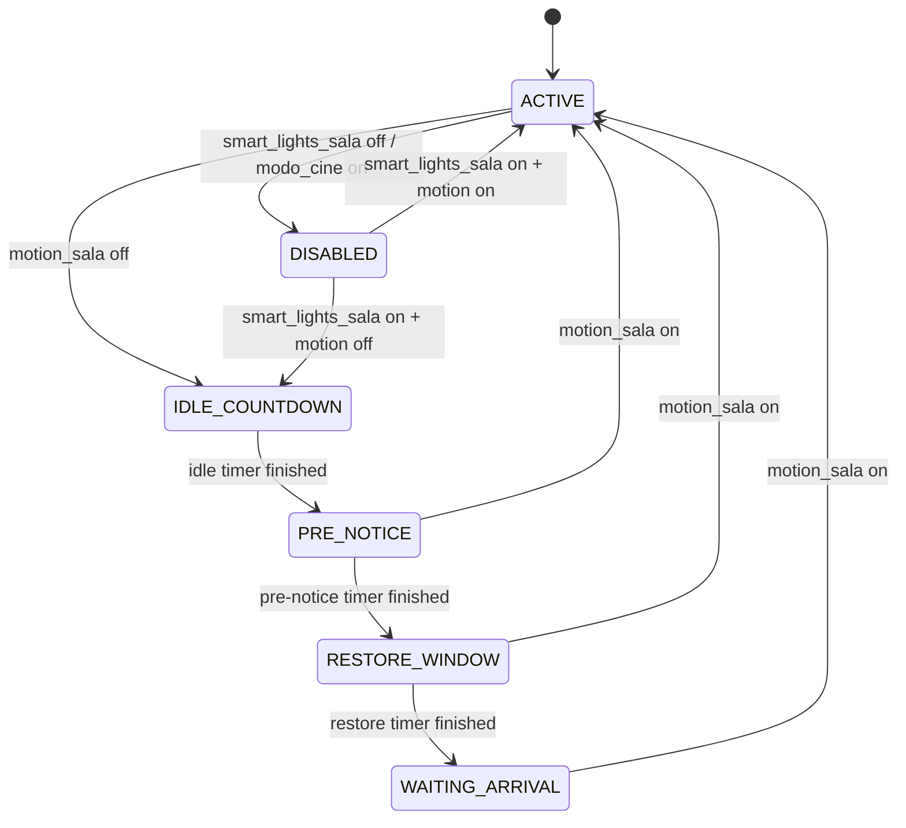

# Smart Light Sala / motion_kilo

Documentacion del package `packages/sala_auto_motion_kilo.yaml`.

Ultima actualizacion de este documento: 2026-04-21.

## Resumen

Este package controla la iluminacion automatica de la sala de estar usando movimiento, timers, estado logico, snapshot de luces, restauracion suave, moods editables y debug visible en el dashboard.

La idea central es:

1. Si hay movimiento, la sala queda en `ACTIVE`.
2. Si deja de haber movimiento, empieza una cuenta regresiva (`IDLE_COUNTDOWN`).
3. Antes de apagar, entra en `PRE_NOTICE` y reduce el brillo.
4. Cuando termina el preaviso, apaga las luces y abre una ventana de restore (`RESTORE_WINDOW`).
5. Si vuelve movimiento durante esa ventana, restaura el snapshot previo.
6. Si no vuelve movimiento, queda en `WAITING_ARRIVAL`.
7. Si aparece movimiento desde `WAITING_ARRIVAL`, prende la sala usando el mood actual.

El package tambien respeta `input_boolean.modo_cine`: mientras modo cine esta activo, Smart Light Sala no debe tomar control normal de las luces.

## Archivos Relacionados

- `packages/sala_auto_motion_kilo.yaml`: package principal.
- `packages/sala_auto_motion_kilo.md`: esta documentacion.
- `scripts.yaml`: scripts editables desde UI, incluyendo la matriz `sala_mood_<mood>_<franja>`.
- `automations.yaml`: integracion externa con modo cine.
- `packages/sleep/yendo_a_dormir_v2.yaml`: integracion externa con modo dormir.
- `packages/failsafe_apagado_luces.yaml`: failsafe general de apagado por inactividad.

## Requisitos

Este package espera que existan estas piezas:

- Integracion HACS `var`, usada por `var.smart_light_sala_snapshot_targets`.
- `binary_sensor.motion_sala`.
- `sensor.parte_del_dia`, con valores esperados: `manana`, `mediodia`, `tarde`, `noche`, `madrugada`.
- Area de Home Assistant `sala_de_estar`, con las luces de la sala.
- `input_boolean.modo_cine`.
- `script.gradual_brightness_worker`.
- `script.gradual_restore_from_snapshot`.

Tambien usa scripts externos de iluminacion existentes, por ejemplo:

- `script.luces_manana`
- `script.luces_tarde`
- `script.luces_madrugada`

## Modelo Mental

Smart Light Sala es una maquina de estados. La entidad canonica del estado logico es:

`input_select.smart_light_sala_state`

Estados posibles:

- `ACTIVE`: hay movimiento o la automatizacion esta activa normalmente.
- `IDLE_COUNTDOWN`: no hay movimiento y esta corriendo el timer antes del preaviso.
- `PRE_NOTICE`: se esta reduciendo el brillo antes del apagado.
- `RESTORE_WINDOW`: las luces ya se apagaron y todavia se puede restaurar el snapshot si vuelve movimiento.
- `WAITING_ARRIVAL`: ya paso la ventana de restore; el proximo movimiento prende segun mood.
- `DISABLED`: Smart Light Sala esta apagado o bloqueado por un modo externo.

Flujo principal:



## Como Usarlo

### Encender o apagar la automatizacion

Usar:

`input_boolean.smart_lights_sala`

- `on`: Smart Light Sala controla la sala.
- `off`: Smart Light Sala queda en `DISABLED`, cancela timers/fades y no toca las luces.

Este helper reemplaza al viejo `input_boolean.sala_auto_bypass`.

### Elegir mood

Usar:

`input_select.smart_light_sala_mood`

Opciones actuales:

- `normal`
- `chill`
- `tv`
- `cena`
- `noche`

Cuando Smart Light Sala necesita prender luces automaticamente, llama a `script.smart_light_sala_turn_on_lights`. Ese script mira el mood actual y la franja horaria simplificada:

- `manana`, `mediodia`, `tarde` -> `dia`
- `noche` -> `noche`
- `madrugada` -> `madrugada`

Luego intenta llamar un script con este patron:

`script.sala_mood_<mood>_<franja>`

Ejemplos:

- `script.sala_mood_chill_noche`
- `script.sala_mood_tv_madrugada`
- `script.sala_mood_cena_dia`
- `script.sala_mood_normal_dia`

### Ajustar tiempos

Los timeouts controlan cuanto espera sin movimiento antes de empezar el preaviso.

Ejemplo:

- Si `input_number.smart_light_sala_timeout_noche` esta en 5 minutos, el flujo sin movimiento dura 5 minutos en total.
- El package reserva hasta 120 segundos para `PRE_NOTICE`.
- Entonces, si el timeout total es 5 minutos, el idle timer corre 3 minutos y el preaviso corre 2 minutos.
- Si el timeout total es menor a 120 segundos, todo el tiempo se usa como preaviso.

### Ajustar ventana de restore

Los helpers `smart_light_sala_arribo_*` controlan cuanto dura `RESTORE_WINDOW` despues del apagado.

Durante `RESTORE_WINDOW`:

- Si vuelve movimiento, se restaura el snapshot previo con `script.gradual_restore_from_snapshot`.
- Si no vuelve movimiento antes de que termine el timer, el estado pasa a `WAITING_ARRIVAL`.

### Ajustar brillo fallback

Los helpers `smart_light_sala_brightness_*` se usan solo cuando no hay mood script ni effect override valido.

En el flujo normal, el encendido suele ir por scripts de mood en `scripts.yaml`.

### Debug

Activar:

`input_boolean.smart_light_sala_debug_mode`

Cuando esta en `on`, el package:

- escribe en `system_log` con logger `smart_light_sala`;
- actualiza `input_text.smart_light_sala_debug_message`;
- actualiza `input_text.smart_light_sala_debug_context`;
- mantiene un historial corto en `input_text.smart_light_sala_debug_history`;
- incrementa `counter.smart_light_sala_debug_events`;
- expone todo en `sensor.smart_light_sala_debug`.

El debug esta encapsulado en `script.smart_light_sala_debug_emit`, para que las automations principales no carguen logica pesada.

### Reset manual

Usar:

`script.smart_light_sala_reset_runtime`

Hace:

1. Emite debug.
2. Cancela timers y workers activos.
3. Recalcula segun contexto actual:
   - si Smart Lights esta off o modo cine esta on, entra en `DISABLED`;
   - si hay movimiento, entra en `ACTIVE` y aplica mood;
   - si no hay movimiento, entra en `IDLE_COUNTDOWN`.

Es ideal para un boton en dashboard.

## Entidades

### var

| Entidad | Uso |
| --- | --- |
| `var.smart_light_sala_snapshot_targets` | Guarda un JSON con el brillo objetivo por luz al tomar snapshot. Lo usa la restauracion gradual. Requiere la integracion HACS `var`. |

### input_select

| Entidad | Opciones | Uso |
| --- | --- | --- |
| `input_select.smart_light_sala_state` | `ACTIVE`, `IDLE_COUNTDOWN`, `PRE_NOTICE`, `RESTORE_WINDOW`, `WAITING_ARRIVAL`, `DISABLED` | Estado logico interno. No conviene modificarlo manualmente salvo debug avanzado. |
| `input_select.smart_light_sala_mood` | `normal`, `chill`, `tv`, `cena`, `noche` | Selector visible de mood para la sala. Es el control principal de escenas/scripts de iluminacion. |

### input_boolean

| Entidad | Default | Uso |
| --- | --- | --- |
| `input_boolean.smart_lights_sala` | `on` | Habilita o deshabilita Smart Light Sala. Reemplaza al viejo bypass `sala_auto_bypass`. |
| `input_boolean.smart_light_sala_debug_mode` | `off` | Activa debug informativo en log y dashboard. |
| `input_boolean.smart_light_sala_fade` | `on` | Define si `PRE_NOTICE` reduce brillo con fade gradual o reduccion instantanea. |
| `input_boolean.smart_light_sala_fading_active` | n/a | Flag interno para workers de fade. Se apaga al cancelar runtime o volver a `ACTIVE`. |

### input_number: timeouts

Estos valores estan en minutos. Definen el tiempo total desde que se pierde movimiento hasta que termina `PRE_NOTICE`.

| Entidad | Rango | Default | Uso |
| --- | --- | --- | --- |
| `input_number.smart_light_sala_timeout_manana` | 1-60 | 5 | Timeout para `manana`. |
| `input_number.smart_light_sala_timeout_mediodia` | 1-60 | 5 | Timeout para `mediodia`. |
| `input_number.smart_light_sala_timeout_tarde` | 1-60 | 5 | Timeout para `tarde`. |
| `input_number.smart_light_sala_timeout_noche` | 1-60 | 5 | Timeout para `noche`. |
| `input_number.smart_light_sala_timeout_madrugada` | 1-60 | 3 | Timeout para `madrugada`. |

### input_number: arribo / restore

Estos valores estan en minutos. Definen cuanto dura `RESTORE_WINDOW`.

| Entidad | Rango | Default | Uso |
| --- | --- | --- | --- |
| `input_number.smart_light_sala_arribo_manana` | 1-120 | 4 | Restore window para `manana`. |
| `input_number.smart_light_sala_arribo_mediodia` | 1-120 | 4 | Restore window para `mediodia`. |
| `input_number.smart_light_sala_arribo_tarde` | 1-120 | 4 | Restore window para `tarde`. |
| `input_number.smart_light_sala_arribo_noche` | 1-120 | 4 | Restore window para `noche`. |
| `input_number.smart_light_sala_arribo_madrugada` | 1-120 | 2 | Restore window para `madrugada`. |

### input_number: brightness fallback

Estos valores van de 0 a 255. Solo se usan cuando no hay script de mood ni effect override valido.

| Entidad | Default | Uso |
| --- | --- | --- |
| `input_number.smart_light_sala_brightness_manana` | 200 | Brillo fallback para `manana`. |
| `input_number.smart_light_sala_brightness_mediodia` | 200 | Brillo fallback para `mediodia`. |
| `input_number.smart_light_sala_brightness_tarde` | 200 | Brillo fallback para `tarde`. |
| `input_number.smart_light_sala_brightness_noche` | 150 | Brillo fallback para `noche`. |
| `input_number.smart_light_sala_brightness_madrugada` | 50 | Brillo fallback para `madrugada`. |

### input_number: fade y reduccion

| Entidad | Default | Uso |
| --- | --- | --- |
| `input_number.smart_light_sala_reduction_percentage` | 50 | Porcentaje de reduccion instantanea cuando `smart_light_sala_fade` esta off. Se aplica por luz desde su brillo actual, para evitar subidas accidentales. |
| `input_number.smart_light_sala_fade_sec` | 20 | Duracion del fade gradual y de la restauracion suave. |
| `input_number.smart_light_sala_fade_reduce_pct` | 50 | Porcentaje de reduccion para fade gradual durante `PRE_NOTICE`. |

### input_text: effect overrides

Estos helpers son overrides opcionales. Si tienen un nombre de script valido, ganan por sobre el script de mood.

Importante: se escribe el nombre sin `script.`. Ejemplo: `mi_script_de_luces`.

| Entidad | Uso |
| --- | --- |
| `input_text.smart_light_sala_effect_script_name` | Override global. Default vacio. |
| `input_text.smart_light_sala_effect_script_manana` | Override para `manana`. |
| `input_text.smart_light_sala_effect_script_mediodia` | Override para `mediodia`. |
| `input_text.smart_light_sala_effect_script_tarde` | Override para `tarde`. |
| `input_text.smart_light_sala_effect_script_noche` | Override para `noche`. |
| `input_text.smart_light_sala_effect_script_madrugada` | Override para `madrugada`. |

Orden de resolucion de encendido:

1. Si se pide `use_scene: true` y existe snapshot, restaura `scene.smart_light_sala_snapshot`.
2. Si existe effect override por franja o global, ejecuta ese script.
3. Si existe script de mood exacto, lo ejecuta.
4. Si no existe mood exacto, intenta fallback de mood a `dia`.
5. Si no existe, intenta `normal_<franja>`.
6. Si no existe, intenta `normal_dia`.
7. Si nada existe, hace fallback simple con `light.turn_on` y brightness por franja.

### input_text: debug

| Entidad | Uso |
| --- | --- |
| `input_text.smart_light_sala_debug_message` | Ultimo mensaje humano de debug. |
| `input_text.smart_light_sala_debug_context` | Contexto tecnico corto del ultimo evento. |
| `input_text.smart_light_sala_debug_history` | Historial corto de eventos recientes. |

### input_datetime

| Entidad | Uso |
| --- | --- |
| `input_datetime.smart_light_sala_debug_last_update` | Fecha y hora del ultimo evento debug. |

### counter

| Entidad | Uso |
| --- | --- |
| `counter.smart_light_sala_debug_events` | Cantidad de eventos debug emitidos desde el ultimo reset del counter. |

### timers

| Entidad | Restore | Uso |
| --- | --- | --- |
| `timer.smart_light_sala_idle_timeout` | `true` | Timer de inactividad antes de `PRE_NOTICE`. Es escuchado por una automatizacion `timer.finished`, no por un script en espera. |
| `timer.smart_light_sala_dim_notice` | `true` | Timer del preaviso. Al activarse dispara snapshot + reduccion de brillo. Al terminar abre `RESTORE_WINDOW`. |
| `timer.smart_light_sala_restore_window` | `true` | Ventana posterior al apagado. Si vuelve movimiento antes de terminar, se restaura snapshot. Si termina, pasa a `WAITING_ARRIVAL`. |

## Sensores Template

### sensor.smart_light_sala_state

Estado principal para dashboard. Su `state` es el valor de `input_select.smart_light_sala_state`.

Atributos:

| Atributo | Uso |
| --- | --- |
| `next_action` | Texto humano para mostrar que esta haciendo o esperando el sistema. |
| `next_icon` | Icono sugerido para cards. |
| `next_color` | Color sugerido para chips/cards. |
| `timer_entity` | Timer relevante segun estado actual. |
| `remaining` | Tiempo restante bruto del timer actual. |
| `remaining_pretty` | Tiempo restante formateado para UI. Soporta formatos con dias o fracciones. |

### sensor.smart_light_sala_debug

Sensor para dashboard de debug.

Atributos:

| Atributo | Uso |
| --- | --- |
| `enabled` | Indica si `input_boolean.smart_light_sala_debug_mode` esta on. |
| `context` | Contexto del ultimo evento. |
| `history` | Historial corto. |
| `event_count` | Valor de `counter.smart_light_sala_debug_events`. |
| `last_update` | Ultimo timestamp de debug. |

## Scripts Del Package

### script.smart_light_sala_debug_emit

Worker centralizado de debug.

Campos:

- `event`: nombre corto del evento.
- `message`: texto humano.
- `context`: datos tecnicos cortos.
- `level`: `debug`, `info`, `warning` o `error`.

Solo hace trabajo si `input_boolean.smart_light_sala_debug_mode` esta on.

### script.smart_light_sala_save_scene

Crea `scene.smart_light_sala_snapshot` con las luces leaf del area `sala_de_estar`.

Tambien guarda un mapa JSON en:

`var.smart_light_sala_snapshot_targets`

Ese mapa contiene un porcentaje por luz para que `script.gradual_restore_from_snapshot` pueda restaurar de forma mas suave.

### script.smart_light_sala_reduce_brightness

Reduce brillo instantaneamente cuando el fade esta desactivado.

Detalles importantes:

- Solo actua sobre luces encendidas y dimmeables.
- Calcula el target desde el brillo actual de cada luz.
- Evita que una luz que ya estaba baja suba por accidente.

### script.smart_light_sala_turn_off_lights

Apaga todas las luces leaf del area `sala_de_estar`.

### script.smart_light_sala_turn_on_lights

Worker de encendido.

Puede recibir:

```yaml
variables:
  use_scene: false
```

Si `use_scene` es `true`, intenta restaurar `scene.smart_light_sala_snapshot`.

Si `use_scene` es `false`, resuelve effect override, mood script o fallback simple.

### script.smart_light_sala_set_state

Cambia `input_select.smart_light_sala_state`.

Campo:

- `target_state`

Usarlo en vez de setear el input_select directamente cuando se quiera mantener debug consistente.

### script.smart_light_sala_cancel_motion_runtime

Cancela:

- `timer.smart_light_sala_idle_timeout`
- `timer.smart_light_sala_dim_notice`
- `timer.smart_light_sala_restore_window`
- `script.gradual_brightness_change`
- `script.gradual_restore_from_snapshot`
- `script.gradual_brightness_worker`

Tambien apaga `input_boolean.smart_light_sala_fading_active`.

### script.smart_light_sala_enter_disabled

Entra en `DISABLED`.

Hace:

1. Debug.
2. Setea estado `DISABLED`.
3. Cancela runtime.

No toca las luces.

### script.smart_light_sala_enter_idle_countdown

Entrada publica a `IDLE_COUNTDOWN`.

Hace debug y llama a `script.smart_light_sala_start_idle_flow`.

### script.smart_light_sala_start_idle_flow

Calcula:

- franja actual desde `sensor.parte_del_dia`;
- timeout total desde `input_number.smart_light_sala_timeout_*`;
- duracion de `PRE_NOTICE`;
- duracion previa al preaviso.

Luego:

1. valida que Smart Lights este on, modo cine off y motion off;
2. setea `IDLE_COUNTDOWN`;
3. cancela timers incompatibles;
4. arranca `timer.smart_light_sala_idle_timeout`;
5. si el timeout es muy corto, salta directo a `script.smart_light_sala_start_pre_notice_window`.

### script.smart_light_sala_start_pre_notice_window

Arranca el timer de `PRE_NOTICE`.

Este worker existe para que el paso de idle a preaviso sea event-driven y sobreviva mejor a reinicios.

Valida:

- Smart Lights on;
- modo cine off;
- motion off;
- estado actual `IDLE_COUNTDOWN`;
- duracion de preaviso mayor a 0.

Luego cancela `timer.smart_light_sala_idle_timeout` y arranca `timer.smart_light_sala_dim_notice`.

### script.smart_light_sala_enter_pre_notice

Se ejecuta cuando `timer.smart_light_sala_dim_notice` pasa a `active`.

Hace:

1. valida runtime;
2. setea estado `PRE_NOTICE`;
3. guarda snapshot;
4. cancela cualquier restore timer viejo;
5. reduce brillo con fade o reduccion instantanea.

No arranca `timer.smart_light_sala_restore_window`. Ese timer empieza recien cuando termina el preaviso.

### script.smart_light_sala_enter_restore_window

Se ejecuta cuando termina `timer.smart_light_sala_dim_notice`.

Hace:

1. valida runtime, motion off y estado `PRE_NOTICE`;
2. apaga flag de fading;
3. apaga luces de la sala;
4. setea estado `RESTORE_WINDOW`;
5. arranca `timer.smart_light_sala_restore_window` usando el `arribo_*` de la franja actual.

### script.smart_light_sala_enter_waiting_arrival

Se ejecuta cuando termina `timer.smart_light_sala_restore_window`.

Hace:

1. valida runtime y estado `RESTORE_WINDOW`;
2. setea `WAITING_ARRIVAL`.

### script.smart_light_sala_toggle_smart_lights

Toggle simple para `input_boolean.smart_lights_sala`.

Sirve para un boton de dashboard.

### script.smart_light_sala_reset_runtime

Reset manual de la maquina.

Uso recomendado:

- boton de dashboard;
- Developer Tools cuando el estado quedo raro;
- pruebas despues de editar scripts de mood.

## Scripts De Mood En scripts.yaml

Los scripts de mood estan fuera del package para que sean editables desde la UI de Home Assistant.

Matriz actual:

| Mood | Dia | Noche | Madrugada |
| --- | --- | --- | --- |
| `normal` | `script.sala_mood_normal_dia` | `script.sala_mood_normal_noche` | `script.sala_mood_normal_madrugada` |
| `chill` | `script.sala_mood_chill_dia` | `script.sala_mood_chill_noche` | `script.sala_mood_chill_madrugada` |
| `tv` | `script.sala_mood_tv_dia` | `script.sala_mood_tv_noche` | `script.sala_mood_tv_madrugada` |
| `cena` | `script.sala_mood_cena_dia` | `script.sala_mood_cena_noche` | `script.sala_mood_cena_madrugada` |
| `noche` | `script.sala_mood_noche_dia` | `script.sala_mood_noche_noche` | `script.sala_mood_noche_madrugada` |

### Como editar un mood

Editar el script correspondiente desde la UI de Home Assistant o en `scripts.yaml`.

Ejemplo:

Si queres cambiar que pasa cuando el mood es `tv` y es de noche, editar:

`script.sala_mood_tv_noche`

Dentro de ese script podes:

- prender luces directamente;
- llamar escenas;
- llamar otros scripts;
- hacer efectos;
- usar delays/transiciones;
- cambiar colores o temperatura.

### Como agregar un mood nuevo

1. Agregar una opcion nueva a `input_select.smart_light_sala_mood`.
2. Crear scripts en `scripts.yaml` con este patron:
   - `sala_mood_<nuevo_mood>_dia`
   - `sala_mood_<nuevo_mood>_noche`
   - `sala_mood_<nuevo_mood>_madrugada`
3. Recargar helpers/scripts o reiniciar Home Assistant segun corresponda.
4. Probar con debug on.

## Automations Del Package

### smart_light_sala - HA START -> recover runtime

Se ejecuta al iniciar Home Assistant.

Objetivo: reconstruir estado logico despues de reinicios.

Orden de decision:

1. Si Smart Lights esta off o modo cine on, entra en `DISABLED`.
2. Si motion esta on, entra en `ACTIVE` y cancela runtime.
3. Si `timer.smart_light_sala_dim_notice` esta activo, setea `PRE_NOTICE`.
4. Si `timer.smart_light_sala_restore_window` esta activo, setea `RESTORE_WINDOW`.
5. Si `timer.smart_light_sala_idle_timeout` esta activo, setea `IDLE_COUNTDOWN`.
6. Si motion esta off y no hay timers activos, entra en `IDLE_COUNTDOWN`.

### smart_light_sala - Smart Lights Sala OFF -> DISABLED

Cuando `input_boolean.smart_lights_sala` pasa a off:

- entra en `DISABLED`;
- cancela timers y workers;
- no toca las luces.

### smart_light_sala - Smart Lights Sala ON -> recompute

Cuando `input_boolean.smart_lights_sala` pasa a on:

- si hay motion, entra en `ACTIVE`, cancela runtime y aplica el mood actual;
- si no hay motion, entra en `IDLE_COUNTDOWN`.

No corre si `input_boolean.modo_cine` esta on.

### smart_light_sala - Motion OFF -> IDLE_COUNTDOWN

Cuando `binary_sensor.motion_sala` pasa a off:

- si Smart Lights esta on y modo cine off, entra en `IDLE_COUNTDOWN`.

### smart_light_sala - IDLE FIN -> PRE_NOTICE timer

Cuando termina `timer.smart_light_sala_idle_timeout`:

- valida que Smart Lights este on;
- valida modo cine off;
- valida motion off;
- valida estado `IDLE_COUNTDOWN`;
- llama a `script.smart_light_sala_start_pre_notice_window`.

Este cambio evita depender de un `wait_for_trigger` dentro de un script, que se pierde al reiniciar Home Assistant.

### smart_light_sala - Motion ON -> ACTIVE (V2 restore suave)

Cuando vuelve movimiento:

1. setea `ACTIVE`;
2. cancela timers y fades;
3. si venia de `PRE_NOTICE` o `RESTORE_WINDOW`, restaura snapshot con `script.gradual_restore_from_snapshot`;
4. si venia de `WAITING_ARRIVAL`, prende por mood con `script.smart_light_sala_turn_on_lights`.

### smart_light_sala - PRE_NOTICE START - snapshot + dim/fade

Cuando `timer.smart_light_sala_dim_notice` pasa a active:

- llama a `script.smart_light_sala_enter_pre_notice`.

### smart_light_sala - PRE_NOTICE FIN - apagar + RESTORE START

Cuando termina `timer.smart_light_sala_dim_notice`:

- llama a `script.smart_light_sala_enter_restore_window`.

### smart_light_sala - RESTORE FIN - WAITING_ARRIVAL

Cuando termina `timer.smart_light_sala_restore_window`:

- llama a `script.smart_light_sala_enter_waiting_arrival`.

## Integraciones Externas

### Modo cine

`automations.yaml` usa `input_boolean.smart_lights_sala` para suspender o reactivar Smart Light Sala cuando entra o sale modo cine.

El objetivo es que mientras modo cine esta activo, las luces no vuelvan al comportamiento normal por movimiento.

### Modo dormir

`packages/sleep/yendo_a_dormir_v2.yaml` usa entidades nuevas:

- `input_boolean.smart_lights_sala`
- `input_select.smart_light_sala_state`
- `timer.smart_light_sala_idle_timeout`
- `timer.smart_light_sala_dim_notice`
- `timer.smart_light_sala_restore_window`

Esto reemplaza referencias antiguas `sala_auto_*`.

### Failsafe de apagado

`packages/failsafe_apagado_luces.yaml` tiene un failsafe general para apagar luces por inactividad.

La parte de cocina fue blindada para que la plantilla no falle si `binary_sensor.motion_cocina` no existe o no esta disponible.

## Dashboard Recomendado

Para controlar el paquete desde Lovelace conviene mostrar:

- `input_boolean.smart_lights_sala`
- `input_select.smart_light_sala_mood`
- `sensor.smart_light_sala_state`
- atributo `next_action`
- atributo `remaining_pretty`
- `input_boolean.smart_light_sala_debug_mode`
- `sensor.smart_light_sala_debug`
- `script.smart_light_sala_reset_runtime`

Controles utiles:

- Toggle de Smart Lights.
- Selector de mood.
- Boton de reset runtime.
- Toggle debug.
- Card de estado con timer actual.
- Card de historial debug.

## Eventos Debug Comunes

| Evento | Significado |
| --- | --- |
| `set_state` | Cambio de estado logico. |
| `cancel_runtime` | Se cancelaron timers/workers. |
| `idle_flow_start` | Arranco cuenta regresiva por falta de movimiento. |
| `idle_to_pre_notice` | Termino idle y arranca preaviso. |
| `enter_pre_notice` | Se guardo snapshot y empieza reduccion de brillo. |
| `enter_restore_window` | Termino preaviso, se apagaron luces y arranca restore. |
| `enter_waiting_arrival` | Termino restore window. |
| `motion_restore_snapshot` | Volvio movimiento y se restaura snapshot. |
| `turn_on_mood_script` | Se ejecuto script de mood. |
| `turn_on_effect_script` | Se ejecuto override configurado. |
| `turn_on_fallback` | No habia script valido y se uso brillo fallback. |
| `enter_pre_notice_ignored` | Se intento entrar a PRE_NOTICE pero el contexto ya no era valido. |
| `enter_restore_window_ignored` | Se intento entrar a RESTORE_WINDOW pero el contexto ya no era valido. |
| `enter_waiting_arrival_ignored` | Se intento entrar a WAITING_ARRIVAL pero el contexto ya no era valido. |
| `ha_start_recover_*` | Recovery despues de reinicio de Home Assistant. |
| `reset_runtime` | Reset manual desde script. |

## Tuning Recomendado

### Si las luces se apagan demasiado rapido

Subir:

- `input_number.smart_light_sala_timeout_noche`
- `input_number.smart_light_sala_timeout_madrugada`
- o la franja correspondiente.

### Si el preaviso dura demasiado

El preaviso usa hasta 120 segundos del timeout total. Para acortarlo hay que cambiar la logica de `pre_notice_sec` en `script.smart_light_sala_start_idle_flow`.

### Si vuelve movimiento y restaura demasiado fuerte

Ajustar:

- `input_number.smart_light_sala_fade_sec`
- `script.gradual_restore_from_snapshot`
- los scripts de mood, si el reencendido viene desde `WAITING_ARRIVAL`.

### Si un mood no se aplica

Revisar:

1. `input_select.smart_light_sala_mood`.
2. `sensor.parte_del_dia`.
3. Que exista `script.sala_mood_<mood>_<franja>`.
4. Que no haya un effect override en `input_text.smart_light_sala_effect_script_*`.
5. Debug event `turn_on_lights`, que muestra `mood_script` y `effect_override`.

### Si modo cine no bloquea Smart Light Sala

Revisar:

- `input_boolean.modo_cine`;
- `input_boolean.smart_lights_sala`;
- debug events `enter_*_ignored`;
- automatizacion externa de `automations.yaml` que apaga/prende `input_boolean.smart_lights_sala`.

## Notas De Mantenimiento

- Los nombres legacy `sala_auto_*` fueron reemplazados por `smart_light_sala_*` o `smart_lights_sala`.
- Los scripts de mood viven en `scripts.yaml` para que Home Assistant los pueda editar desde UI.
- Los effect script helpers no son el flujo principal. Son overrides voluntarios.
- `timer.smart_light_sala_idle_timeout` ahora representa solo el tramo antes de `PRE_NOTICE`, no todo el timeout total.
- `timer.smart_light_sala_restore_window` empieza solo despues de apagar, no durante `PRE_NOTICE`.
- Las automations principales llaman workers. Esto mantiene la logica concentrada en scripts reutilizables.
- Los workers criticos tienen guardas internas para evitar cambios de estado si se llaman manualmente en contexto incorrecto.

## Checklist De Prueba

Despues de modificar el package, probar:

1. Activar debug.
2. Poner mood `normal`.
3. Generar motion on y confirmar `ACTIVE`.
4. Generar motion off y confirmar `IDLE_COUNTDOWN`.
5. Esperar fin de idle y confirmar `PRE_NOTICE`.
6. Confirmar snapshot y reduccion/fade.
7. Esperar fin de preaviso y confirmar `RESTORE_WINDOW`.
8. Generar motion durante `RESTORE_WINDOW` y confirmar restore suave.
9. Repetir y dejar terminar `RESTORE_WINDOW`, confirmar `WAITING_ARRIVAL`.
10. Generar motion desde `WAITING_ARRIVAL` y confirmar encendido por mood.
11. Probar `input_boolean.smart_lights_sala` off/on con motion on.
12. Probar modo cine activo y confirmar que no reacciona como modo normal.
13. Reiniciar Home Assistant con un timer activo y revisar recovery.

## Changelog

### 2026-04-21

Documentacion:

- Reescritura completa de este README.
- Se actualizaron nombres legacy `sala_auto_*` a `smart_light_sala_*`.
- Se agrego catalogo completo de entidades.
- Se agrego explicacion de maquina de estados.
- Se agrego seccion de mood matrix.
- Se agrego seccion de debug.
- Se agrego checklist de prueba.

Funcionalidad:

- Se agrego `input_select.smart_light_sala_mood`.
- Se agregaron scripts de mood editables desde UI en `scripts.yaml`.
- Se agrego matriz de scripts:
  - `normal_dia`, `normal_noche`, `normal_madrugada`
  - `chill_dia`, `chill_noche`, `chill_madrugada`
  - `tv_dia`, `tv_noche`, `tv_madrugada`
  - `cena_dia`, `cena_noche`, `cena_madrugada`
  - `noche_dia`, `noche_noche`, `noche_madrugada`
- `script.smart_light_sala_turn_on_lights` ahora resuelve mood + franja.
- Los effect script helpers pasaron a funcionar como overrides opcionales.
- Se agrego subsistema debug:
  - `input_boolean.smart_light_sala_debug_mode`
  - `input_text.smart_light_sala_debug_message`
  - `input_text.smart_light_sala_debug_context`
  - `input_text.smart_light_sala_debug_history`
  - `input_datetime.smart_light_sala_debug_last_update`
  - `counter.smart_light_sala_debug_events`
  - `sensor.smart_light_sala_debug`
  - `script.smart_light_sala_debug_emit`
- Se separo la logica pesada en workers:
  - `smart_light_sala_set_state`
  - `smart_light_sala_cancel_motion_runtime`
  - `smart_light_sala_enter_disabled`
  - `smart_light_sala_enter_idle_countdown`
  - `smart_light_sala_enter_pre_notice`
  - `smart_light_sala_enter_restore_window`
  - `smart_light_sala_enter_waiting_arrival`
  - `smart_light_sala_start_pre_notice_window`
  - `smart_light_sala_reset_runtime`
- Se agrego recovery al iniciar Home Assistant.
- Se hizo restart-safe el paso de `IDLE_COUNTDOWN` a `PRE_NOTICE` usando `timer.finished`.
- Se elimino la dependencia de `wait_for_trigger` para la transicion principal de idle.
- Se corrigio el restore timer para que arranque solo al entrar en `RESTORE_WINDOW`.
- Se corrigio la reduccion instantanea de brillo para que no pueda subir luces ya bajas.
- Se agrego recompute al reactivar `input_boolean.smart_lights_sala` con motion activo.
- Se agregaron guardas internas en workers criticos.
- Se hizo mas robusto `remaining_pretty`.

Integraciones:

- `automations.yaml` fue actualizado para usar `input_boolean.smart_lights_sala` al salir de modo cine.
- `packages/sleep/yendo_a_dormir_v2.yaml` fue actualizado para usar timers y estado `smart_light_sala_*`.
- `packages/failsafe_apagado_luces.yaml` fue blindado para `binary_sensor.motion_cocina`.

### Estado anterior

Version inicial del package `motion_kilo`:

- control por movimiento;
- snapshot de luces;
- fade/reduccion en preaviso;
- restore desde snapshot;
- waiting arrival;
- timers por franja;
- soporte de leaf lights del area `sala_de_estar`.

## Validacion

Validaciones locales hechas durante los cambios:

- Parse YAML generico OK en:
  - `packages/sala_auto_motion_kilo.yaml`
  - `packages/failsafe_apagado_luces.yaml`
  - `packages/sleep/yendo_a_dormir_v2.yaml`
  - `automations.yaml`
  - `scripts.yaml`
- Check de claves duplicadas OK.
- `git diff --check` OK.

Pendiente:

- Correr `ha core check` dentro del entorno real de Home Assistant. En esta maquina local el comando `ha` no esta disponible.
