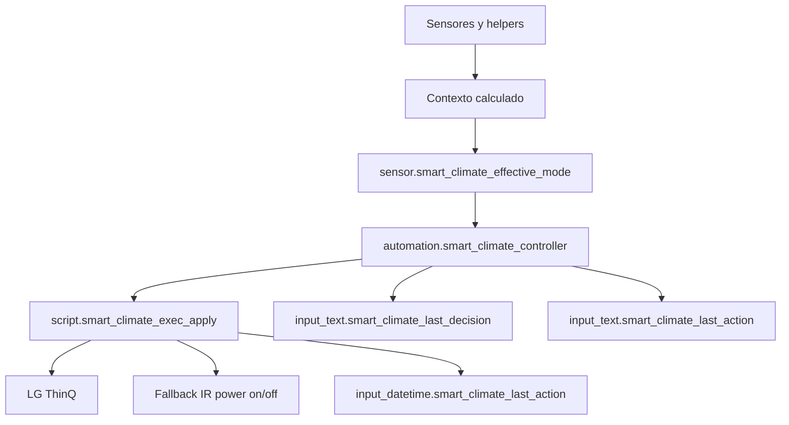

# Smart Climate Core

Documentacion del package `packages/smart_climate_core.yaml`.

Ultima actualizacion de este documento: 2026-04-23.

## Resumen

Este package controla el aire acondicionado de la sala usando una capa de decision automatica y una capa de ejecucion confiable.

La idea central es:

1. Calcular contexto: presencia, sueno, modo manual, locks, timers y temperatura.
2. Elegir un modo efectivo (`sensor.smart_climate_effective_mode`).
3. Decidir una accion: enfriar, apagar, esperar o no hacer nada.
4. Ejecutar siempre mediante `script.smart_climate_exec_apply`.
5. Usar LG ThinQ como control principal y fallback IR para power on/off cuando LG no confirma.
6. Registrar la ultima decision y la ultima accion para debug/dashboard.

El package evita ciclos cortos con timers de minimo encendido/apagado y permite precooling manual o programado para volver de la oficina.

## Archivos Relacionados

- `packages/smart_climate_core.yaml`: package principal.
- `packages/smart_climate_core.md`: esta documentacion.
- `packages/Climate/aire_acondicionado_ir.yaml`: configuracion del control IR.
- `packages/sleep/sleep_detection.yaml`: fuente de `input_select.sleep_state`.
- `packages/notifications/notification_humedad.yaml`: referencia de `sensor.humidity_sala`.
- `packages/sensor_temperatura_outside_pirate.yaml`: sensor exterior legacy basado en Pirate Weather.

## Requisitos

Este package espera que existan estas piezas:

- `climate.aire_acondicionado`: aire principal por LG ThinQ.
- `climate.aire_ir`: fallback IR para power on/off.
- `person.hernan`.
- `sensor.temperature_sala`.
- `sensor.humidity_sala`.
- `weather.pirateweather`.
- `input_select.sleep_state`.
- `input_boolean.modo_sofa`.
- Servicio de notificacion `notify.hernan`.
- Servicio de notificacion movil `notify.mobile_app_samsungs24u`.

## Modelo Mental

Smart Climate Core separa decision y ejecucion.



El controlador no llama servicios `climate.*` directamente. Todas las acciones reales pasan por scripts.

## Modos Efectivos

La entidad canonica del modo calculado es:

`sensor.smart_climate_effective_mode`

| Modo | Cuando aplica | Comportamiento |
| --- | --- | --- |
| `disabled` | `input_boolean.smart_climate` esta off | No ejecuta acciones. |
| `error_lock` | `input_boolean.smart_climate_error_lock` esta on | Solo permite apagados de seguridad. |
| `away` | No estas en casa y no hay precooling | Fuerza apagado. |
| `away_precool` | No estas en casa y hay request/timer de precooling | Enfria a `smart_climate_precool_temp`. |
| `precooling` | Timer de precooling activo o modo `precooling` | Enfria a `smart_climate_precool_temp`. |
| `manual_hold` | Timer manual activo o modo `manual` | No toca el aire, salvo apagado si estas away. |
| `sleeping` | Sueno efectivo activo | Apaga si `smart_climate_allow_sleep_shutdown` esta on. |
| `auto` | Modo normal | Controla por temperatura e histeresis. |
| `override` | Modo override | Controla por temperatura e histeresis. |
| `off` | Modo off seleccionado | Apaga aunque el guardrail normal diga `off`. |

## Como Usarlo

### Encender o apagar Smart Climate

Usar:

`input_boolean.smart_climate`

- `on`: Smart Climate puede decidir y ejecutar.
- `off`: el sistema queda deshabilitado y los scripts abortan.

### Elegir modo

Usar:

`input_select.smart_climate_modo`

Opciones:

- `auto`: control normal por temperatura.
- `manual`: hold manual protegido por `timer.smart_climate_manual_hold`.
- `override`: control automatico sin semantica especial extra.
- `precooling`: fuerza modo de precooling.
- `off`: apaga el aire.

### Ajustar temperatura objetivo

Usar:

`input_number.smart_climate_target_temp_home`

Este es el target base. El controlador usa `sensor.smart_climate_target_temp_effective`, que normalmente coincide con el target base, salvo que este activo el confort por humedad.

### Ajustar histeresis

Usar:

`input_number.smart_climate_hysteresis`

Ejemplo con target efectivo 25.0 C e histeresis 0.5 C:

- Enciende cooling si `sensor.smart_climate_temp_control >= 25.5`.
- Puede apagar si `sensor.smart_climate_temp_control <= 24.5`.
- Dentro de la banda, mantiene estado.

### Precooling manual

Usar:

`input_boolean.smart_climate_user_precool_request`

Cuando pasa a `on`:

1. Inicia `timer.smart_climate_precooling` si no estaba activo.
2. Si el modo estaba en `auto`, cambia a `precooling`.
3. El controller enfria a `input_number.smart_climate_precool_temp`.
4. Al terminar el timer, se apaga el request.
5. Si seguis fuera, apaga el aire.
6. Si ya estas en casa, vuelve a `auto`.

### Enfriar al volver de la oficina

Usar:

`input_boolean.smart_climate_enfriar_al_volver_oficina`

- `off`: los horarios fijos no hacen nada.
- `on`: habilita los slots de weekdays 11:50 y 15:50.

Los slots fijos funcionan como "forzar precooling en este horario":

- Solo corren de lunes a viernes.
- Solo corren si `binary_sensor.smart_climate_is_home` esta off.
- No miran la temperatura interior.
- No se activan en invierno por accidente si este toggle esta apagado.

### Confort por humedad

Usar:

`input_boolean.smart_climate_use_humidity_comfort`

Cuando esta en `on`, el sensor `sensor.smart_climate_target_temp_effective` baja el target si la humedad interior esta alta.

Helpers:

- `input_number.smart_climate_humidity_high_threshold`: umbral de humedad alta, default 65%.
- `input_number.smart_climate_humidity_target_adjustment`: ajuste aplicado al target, default 0.5 C.

Ejemplo:

- Target base: 25.0 C.
- Humedad sala: 70%.
- Threshold: 65%.
- Adjustment: 0.5 C.
- Target efectivo: 24.5 C.

Si `sensor.humidity_sala` esta `unknown` o `unavailable`, el target efectivo vuelve al target base.

## Entidades

### input_boolean

| Entidad | Default | Uso |
| --- | --- | --- |
| `input_boolean.smart_climate` | n/a | Master switch del sistema. |
| `input_boolean.clima_sala_auto` | n/a | Helper legacy para compatibilidad de dashboard. |
| `input_boolean.smart_climate_debug` | n/a | Habilita logs de debug en Logbook. |
| `input_boolean.smart_climate_ir_cooldown` | n/a | Mirror del timer de cooldown IR. |
| `input_boolean.smart_climate_user_precool_request` | n/a | Request manual de precooling. |
| `input_boolean.smart_climate_error_lock` | n/a | Lock de fallos; bloquea acciones normales. |
| `input_boolean.smart_climate_notifications` | n/a | Habilita notificaciones. |
| `input_boolean.smart_climate_allow_sleep_shutdown` | `true` | Permite apagar cuando estas durmiendo. |
| `input_boolean.smart_climate_use_fan_stage` | `false` | Feature switch reservado; no participa hoy en la logica. |
| `input_boolean.smart_climate_enfriar_al_volver_oficina` | `false` | Habilita los slots fijos de precooling 11:50 y 15:50. |
| `input_boolean.smart_climate_use_humidity_comfort` | `false` | Habilita ajuste opcional por humedad alta. |

### input_select

| Entidad | Opciones | Uso |
| --- | --- | --- |
| `input_select.sensor_temp_fav` | `Desde aire`, `Desde sensor` | Fuente preferida de temperatura interior. |
| `input_select.smart_climate_modo` | `auto`, `manual`, `override`, `precooling`, `off` | Modo seleccionado por el usuario. |

### input_number

| Entidad | Rango | Default | Uso |
| --- | --- | --- | --- |
| `input_number.smart_climate_api_fail_count` | 0-999 | n/a | Contador de fallos LG/API. |
| `input_number.smart_climate_temp_offset` | -5 a 5 C | n/a | Offset aplicado a la temperatura de control. |
| `input_number.smart_climate_target_temp_home` | 16-30 C | 25.0 C | Target base normal. |
| `input_number.smart_climate_hysteresis` | 0.1-2.0 C | 0.5 C | Banda anti-oscilacion. |
| `input_number.smart_climate_precool_temp` | 16-24 C | 19.0 C | Target agresivo durante precooling. |
| `input_number.smart_climate_humidity_high_threshold` | 45-85% | 65% | Umbral para confort por humedad. |
| `input_number.smart_climate_humidity_target_adjustment` | 0-2 C | 0.5 C | Cuanto baja el target efectivo con humedad alta. |

### timers

| Entidad | Duracion | Uso |
| --- | --- | --- |
| `timer.smart_climate_ir_cooldown` | 5 min | Evita repetir IR demasiado seguido. |
| `timer.smart_climate_min_on` | 10 min | Tiempo minimo encendido antes de apagar por confort. |
| `timer.smart_climate_min_off` | 6 min | Tiempo minimo apagado antes de encender por confort. |
| `timer.smart_climate_manual_hold` | 1h 30m | Protege control manual temporal. |
| `timer.smart_climate_precooling` | 30 min | Duracion de un ciclo de precooling. |

### input_datetime / input_text

| Entidad | Uso |
| --- | --- |
| `input_datetime.smart_climate_last_action` | Timestamp de ultima accion ejecutada por scripts. |
| `input_text.smart_climate_last_decision` | Ultima decision del controller con trigger. |
| `input_text.smart_climate_last_action` | Ultima accion logica del controller. |

### sensores template

| Entidad | Uso |
| --- | --- |
| `sensor.clima_sala_estado` | Mirror legacy on/off del aire para dashboard. |
| `sensor.clima_sala_temperatura` | Temperatura interior seleccionable: LG o `sensor.temperature_sala`. |
| `sensor.sala_temp_interior` | Alias legacy de temperatura interior. |
| `sensor.sala_temp_exterior` | Temperatura exterior desde `weather.pirateweather`, graficable. |
| `sensor.smart_climate_temp_control` | Temperatura usada por el controlador, con offset. |
| `sensor.smart_climate_target_temp_effective` | Target final usado por el controlador normal. |
| `sensor.smart_climate_temp_delta_vs_mean_10m` | Delta contra media movil de 10 minutos. |
| `sensor.sala_temp_trend_text` | Texto simple de tendencia: subiendo, bajando o estable. |
| `sensor.smart_climate_context` | Contexto: `away`, `home_sleep`, `home_awake`. |
| `sensor.smart_climate_effective_mode` | Modo efectivo calculado. |
| `sensor.smart_climate_action_block_reason` | Primer motivo de bloqueo activo. |
| `sensor.smart_climate_policy_summary` | Resumen compacto para dashboard/debug. |
| `sensor.smart_climate_last_decision_human` | Traduccion legible de la ultima decision. |

### binary_sensor

| Entidad | Uso |
| --- | --- |
| `binary_sensor.smart_climate_is_home` | Mirror de `person.hernan == home`. |
| `binary_sensor.smart_climate_is_sleeping_raw` | Sueno crudo desde `input_select.sleep_state`. |
| `binary_sensor.smart_climate_ignore_sleep` | On si `input_boolean.modo_sofa` ignora politicas de sueno. |
| `binary_sensor.smart_climate_is_sleeping_effective` | Sueno efectivo despues de aplicar modo sofa. |
| `binary_sensor.smart_climate_action_allowed` | On si `smart_climate_action_block_reason == none`. |
| `binary_sensor.sala_temp_trend` | Sensor legacy de tendencia de temperatura. |

## Scripts

### `script.smart_climate_exec_apply`

Wrapper recomendado. Aplica en orden:

1. Power on.
2. HVAC mode.
3. Temperatura.
4. Power off.

Ejemplo:

```yaml
service: script.smart_climate_exec_apply
data:
  power: "on"
  hvac_mode: "cool"
  temperature: 24
```

El script corre en `mode: queued` para no descartar comandos si llega otra decision mientras se espera confirmacion.

### `script.smart_climate_exec_power_on`

Enciende el aire.

Flujo:

1. Si Smart Climate esta off, aborta.
2. Si el aire ya parece encendido, no repite.
3. Intenta LG una vez.
4. Si LG no confirma en 8 segundos, incrementa `smart_climate_api_fail_count`.
5. Si el cooldown IR esta libre, ejecuta `climate.turn_on` sobre `climate.aire_ir` y arranca cooldown.

### `script.smart_climate_exec_power_off`

Apaga el aire.

Flujo equivalente a power on:

1. Si Smart Climate esta off, aborta.
2. Si el aire ya parece apagado, no repite.
3. Intenta LG una vez.
4. Si LG no confirma en 8 segundos, incrementa `smart_climate_api_fail_count`.
5. Si el cooldown IR esta libre, ejecuta `climate.turn_off` sobre `climate.aire_ir` y arranca cooldown.

### `script.smart_climate_exec_set_temperature`

Cambia setpoint por LG. No tiene fallback IR.

```yaml
service: script.smart_climate_exec_set_temperature
data:
  temperature: 24
```

### `script.smart_climate_exec_set_cooling`

Cambia HVAC mode por LG. Modos aceptados:

- `cool`
- `fan_only`
- `auto`

```yaml
service: script.smart_climate_exec_set_cooling
data:
  hvac_mode: "cool"
```

### Helpers de notificacion y acciones rapidas

| Script | Uso |
| --- | --- |
| `script.smart_climate_notify` | Notifica si `smart_climate_notifications` esta on. |
| `script.smart_climate_stop_precooling_and_power_off` | Cancela precooling y apaga. |
| `script.smart_climate_power_off_in_15m` | Espera 15 minutos y apaga. |
| `script.smart_climate_power_on_manual_90m` | Enciende con hold manual por 90 minutos. |
| `script.smart_climate_touch_last_action` | Actualiza timestamp de accion. |
| `script.smart_climate_sync_ir_cooldown` | Sincroniza boolean de cooldown IR con timer. |

## Automatizaciones Principales

### `automation.smart_climate_controller`

Es el controlador de politica.

Triggers principales:

- Cambios de temperatura de control.
- Cambios de modo efectivo.
- Cambios de target efectivo.
- Cambios de histeresis o precool temp.
- Cambios de presencia, sueno, master switch o error lock.
- Fin de timers `smart_climate_min_on` y `smart_climate_min_off`.
- Watchdog cada 5 minutos.

No escucha el fin de `timer.smart_climate_precooling`; eso queda en `smart_climate_precool_end_handler` para evitar carreras.

### Precooling

| Automation | Uso |
| --- | --- |
| `smart_climate_precool_weekday_1150` | Slot oficina weekdays 11:50. Requiere toggle oficina on y estar away. |
| `smart_climate_precool_weekday_1550` | Slot oficina weekdays 15:50. Requiere toggle oficina on y estar away. |
| `smart_climate_precool_request_handler` | Inicia timer al prender `smart_climate_user_precool_request`. |
| `smart_climate_precool_end_handler` | Finaliza precooling, apaga request y restaura politica. |

### Notificaciones accionables

El package usa acciones mobile app:

- `SMART_CLIMATE_TURN_OFF_NOW`
- `SMART_CLIMATE_TURN_OFF_15M`
- `SMART_CLIMATE_TURN_ON_90M`
- `SMART_CLIMATE_REQUEST_PRECOOL`

## Guardrails

`sensor.smart_climate_action_block_reason` define por que no se puede actuar normalmente.

Valores relevantes:

- `none`: permitido.
- `disabled`: master switch off.
- `error_lock`: bloqueo de error.
- `manual_hold`: hold manual activo.
- `off`: modo off seleccionado.
- `min_off_active`: todavia no paso el minimo apagado.

Excepciones de apagado:

- `away`
- `error_lock`
- `off`

En esos modos, un `desired_action: off` puede ejecutarse aunque `action_allowed` sea falso.

## Debug

Activar:

`input_boolean.smart_climate_debug`

Cuando esta en `on`, el package escribe eventos en Logbook con nombres:

- `smart_climate_core`
- `smart_climate_controller`

Entidades utiles para dashboard:

```yaml
sensor.smart_climate_effective_mode
sensor.smart_climate_action_block_reason
binary_sensor.smart_climate_action_allowed
sensor.smart_climate_policy_summary
sensor.smart_climate_last_decision_human
input_text.smart_climate_last_decision
input_text.smart_climate_last_action
input_datetime.smart_climate_last_action
input_number.smart_climate_api_fail_count
timer.smart_climate_min_on
timer.smart_climate_min_off
timer.smart_climate_precooling
timer.smart_climate_ir_cooldown
```

## Escenarios de Prueba Manual

### Modo off

1. Encender el aire.
2. Poner `input_select.smart_climate_modo` en `off`.
3. Esperar el controller.
4. Verificar:
   - `input_text.smart_climate_last_decision` contiene `mode off -> shutdown` o `mode off -> already off`.
   - `input_text.smart_climate_last_action` no queda en `blocked: reason=off`.

### Precooling manual

1. Prender `input_boolean.smart_climate_user_precool_request`.
2. Verificar que `timer.smart_climate_precooling` queda active.
3. Dejar terminar el timer.
4. Verificar que el request vuelve a off.
5. Si estas away, verificar que ejecuta apagado.

### Enfriar al volver de la oficina

1. Dejar `input_boolean.smart_climate_enfriar_al_volver_oficina` off.
2. Confirmar que los slots 11:50/15:50 no disparan precooling.
3. Prender el toggle.
4. Estando away, verificar que el proximo slot prende `smart_climate_user_precool_request`.

### Confort por humedad

1. Apagar `input_boolean.smart_climate_use_humidity_comfort`.
2. Confirmar que `sensor.smart_climate_target_temp_effective` coincide con `smart_climate_target_temp_home`.
3. Prender el boolean.
4. Con `sensor.humidity_sala` por encima del threshold, confirmar que el target efectivo baja segun adjustment.
5. Si humedad esta unavailable, confirmar fallback al target base.

### Fallback IR

1. Simular o esperar una falla LG donde no confirme power on/off.
2. Verificar incremento de `input_number.smart_climate_api_fail_count`.
3. Si `timer.smart_climate_ir_cooldown` esta idle, verificar que se ejecuta `climate.aire_ir`.
4. Verificar que arranca cooldown de 5 minutos.

## Troubleshooting

### No apaga al salir

Revisar:

- `binary_sensor.smart_climate_is_home`
- `sensor.smart_climate_effective_mode`
- `input_text.smart_climate_last_decision`
- `input_text.smart_climate_last_action`
- `input_boolean.smart_climate`

Si el modo es `away`, el apagado deberia bypassear guardrails normales.

### El precooling se prende en un momento no deseado

Revisar:

- `input_boolean.smart_climate_user_precool_request`
- `input_boolean.smart_climate_enfriar_al_volver_oficina`
- `timer.smart_climate_precooling`
- `input_text.smart_climate_last_decision`

Si el toggle de oficina esta off, los slots fijos no deberian iniciar precooling.

### Humedad cambia demasiado el comportamiento

Apagar:

`input_boolean.smart_climate_use_humidity_comfort`

O ajustar:

- `input_number.smart_climate_humidity_high_threshold`
- `input_number.smart_climate_humidity_target_adjustment`

### LG falla pero IR no se dispara

Revisar:

- `timer.smart_climate_ir_cooldown`
- `input_boolean.smart_climate_ir_cooldown`
- `input_number.smart_climate_api_fail_count`
- disponibilidad de `climate.aire_ir`

Si el cooldown esta activo, el fallback IR se bloquea a proposito.

## Mini Guia de Servicios

```yaml
# Aplicar estado completo
service: script.smart_climate_exec_apply
data:
  power: "on"
  hvac_mode: "cool"
  temperature: 24

# Apagar ahora
service: script.smart_climate_exec_apply
data:
  power: "off"

# Precooling manual
service: input_boolean.turn_on
target:
  entity_id: input_boolean.smart_climate_user_precool_request

# Activar horarios de oficina
service: input_boolean.turn_on
target:
  entity_id: input_boolean.smart_climate_enfriar_al_volver_oficina

# Activar confort por humedad
service: input_boolean.turn_on
target:
  entity_id: input_boolean.smart_climate_use_humidity_comfort
```
